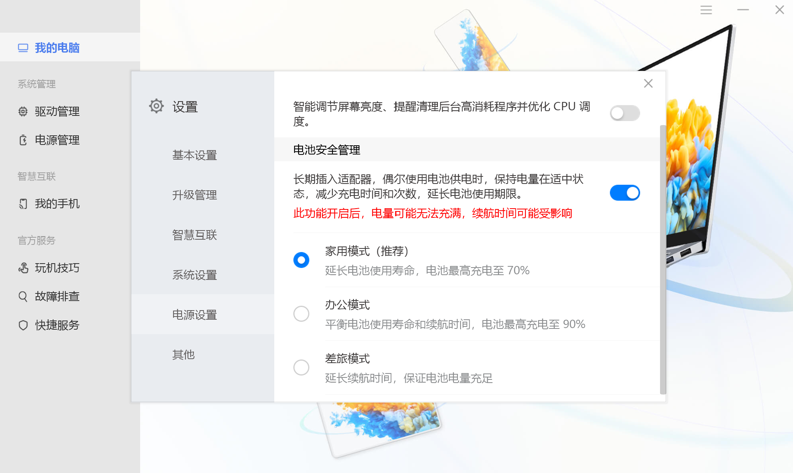
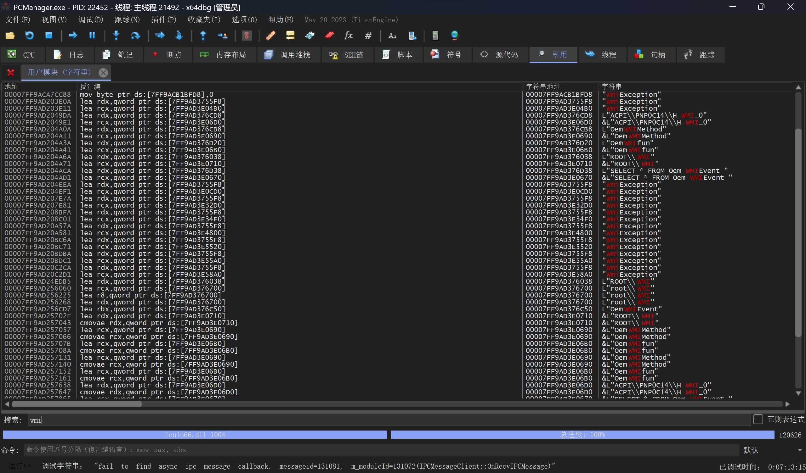
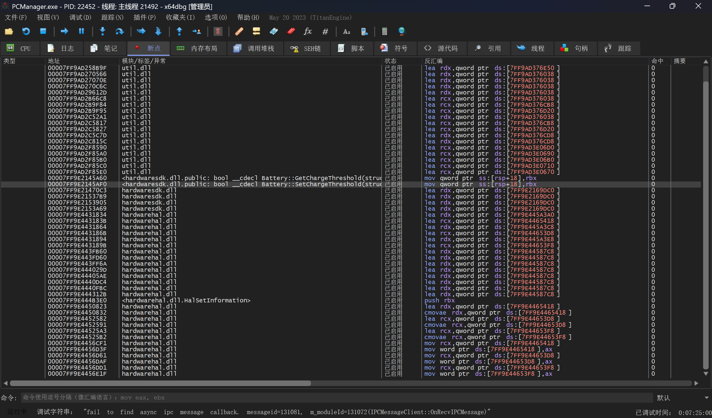
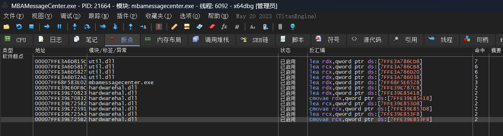
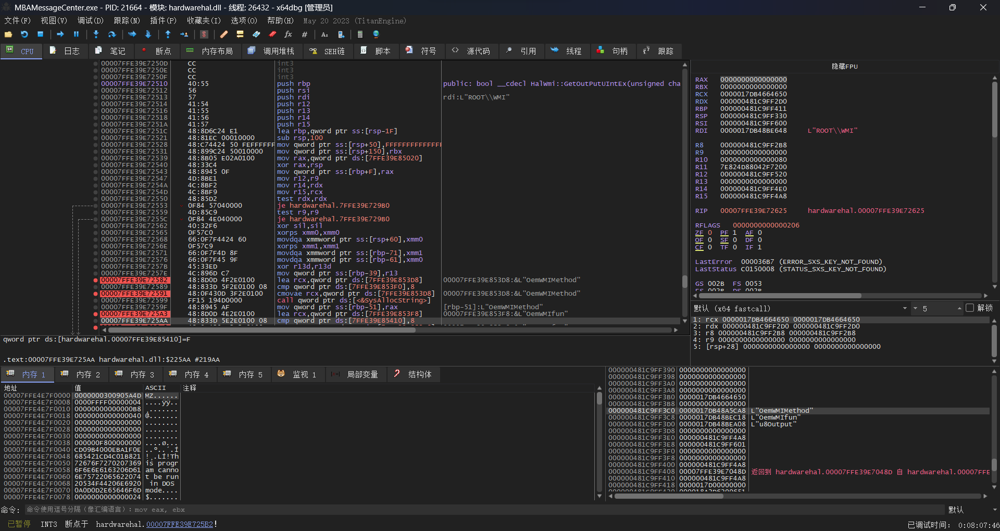
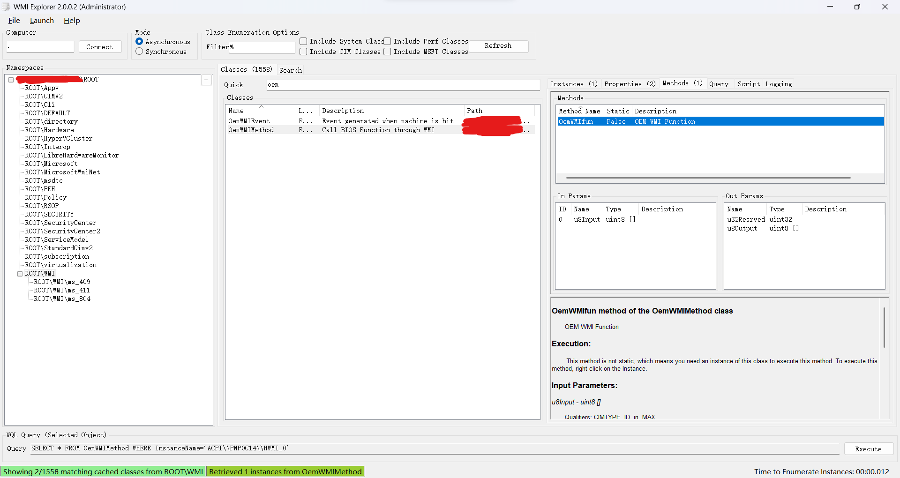
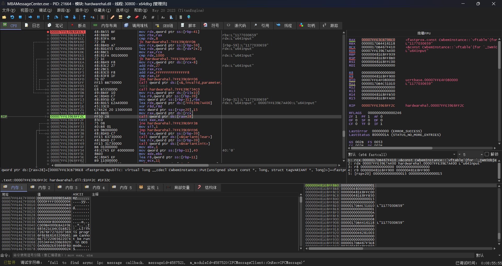
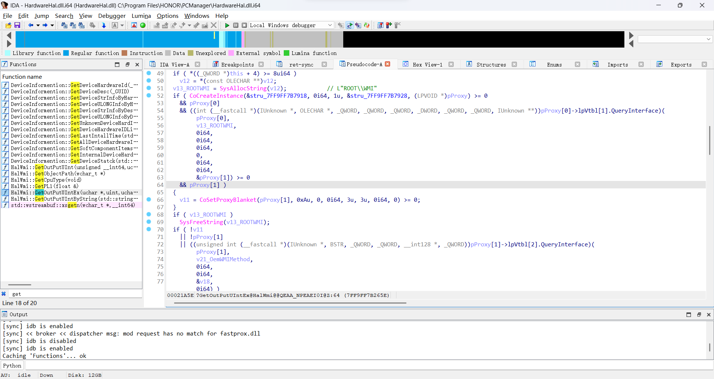
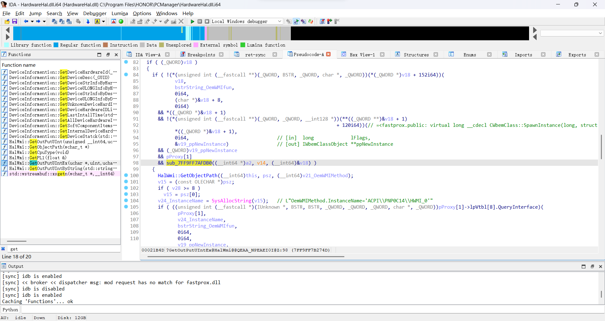
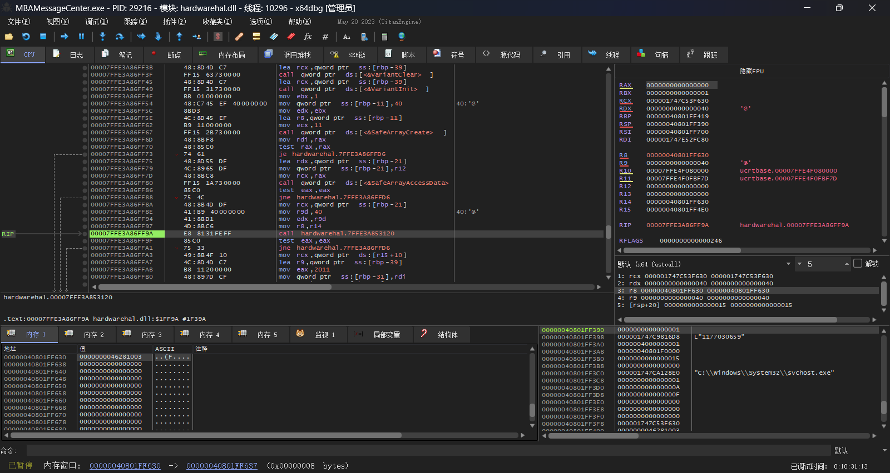

# 华为笔记本充电控制逆向过程记录

## 引言

华为的笔记本出厂会带个电脑管家，里面除了驱动更新和背光热键设置之外，还有华为自己的多屏协同、设备互联功能，然而这些功能我都用不到。后台常驻四五个进程，还时不时的弹窗的体验可说不上好。

之后又买了台Matebook E GO，在这台设备上的电脑管家除了「花里胡哨」的功能更多之外，更是有从S0睡眠恢复后，CPU异常高占用的问题。精简后台迫在眉睫，我唯一需要的后台常驻功能是其中的「智能充电」，也就是笔记本标配的充电控制，因此就有了这个项目的想法


## 开始

首先搜索相关资料，目前网上的华为充电控制都是Linux的项目，并且所有项目都依赖这个内核驱动：[Huawei-WMI](https://github.com/aymanbagabas/Huawei-WMI)

看过后大概能知道是通过WMI(Windows Management Instrumentation)控制的，不过WMI怎么用？WMI GUID哪里找？结构体参数类型是什么？这些对于我这个没接触过原生Windows开发的还是有点难

好吧既然看不懂那就直接上手，x64dbg启动！附加到主进程`PCManager.exe`直接搜索字符串`wmi`看看有什么：

找到几个有意思的字符串：

```c
L"ROOT\\WMI"
L"ACPI\\PNP0C14\\HWMI_0"
L"OemWMIMethod"
L"OemWMIfun"
L"OemWMIEvent"
&L"SELECT * FROM OemWMIEvent "
"BiosWmi::GetOutPutUIntEx"
```

ok我们给这些地址全打上断点，再切换电池控制模式：

嗯？怎么没断上呢？看到下面的ipc message才反应过来，原来这有好几个进程，`PCManager.exe`只是作为UI通知后台服务的。再给剩下的两个进程`MBAMessageCenter.exe`和`PCManagerMainService.exe`同样搜索字符串并全打上断点：

看来只有`MBAMessageCenter.exe`的几个断点能成功生效，`HardwareHal.dll`就是其中的关键：


然后根据栈和上下文得知会调用`HalWmi::GetOutPutUIntEx`这个函数：


## 再次梳理

由上文得知程序会通过路径`ROOT\\WMI`，调用`OemWMIMethod`和`OemWMIfun`这两个WMI函数

我们试试用[WmiExplorer](https://github.com/vinaypamnani/wmie2)查看这函数有哪些参数：


这下就非常清楚是怎么调用的了：
首先转到路径`ROOT\\WMI`，找到类`OemWMIMethod`，获取实例后，调用函数`OemWMIfun`，参数类型为`uint8 []`

这里给出MOF(Managed Object Format)：

```java
[dynamic: ToInstance, provider("WMIProv"), WMI, Description("Call BIOS Function through WMI"), GUID("{ABBC0f5b-8ea1-11d1-A000-c90629100000}"), locale("MS\\0x409")]
class OemWMIMethod
{
    [key, read] string InstanceName;
    [read] Boolean Active;
    [WmiMethodId(1), Implemented, read, write, Description("OEM WMI Function")] void OemWMIfun([in, MAX(64)] uint8 u8Input[], [out] uint32 u32Resrved, [out, MAX(256)] uint8 u8Output[]);
};

```

## 获取参数

现在我们得知大概的调用过程，但是参数具体该填什么还不清楚，再回到x64dbg看下：

这里可以看到`IWbemClassObject::Put`和一个可疑的字符串`L"1177030659"`

选择不同充电选项后都会有对应的字符串，经过测试后得出：

```shell
1677725699 关闭
1514541059 90%
1177030659 70%
1683951619 100%
```

一眼看出这种数值是16进制的，转换之后：

```shell
64001003 关闭
5A461003 90%
46281003 70%
645F1003 100%
```

后四位都是1003，0x6400感觉像是十进制的100和0，试试看每两位转成十进制：

```shell
100,0,16,3 关闭
90,70,16,3 90%
70,40,16,3 70%
100,95,16,3 100%
```

这下完全明白是什么意思了，十六进制前两位是上限，再两位是下限，后面1003固定值

## 尝试调用

接下来试试用PowerShell调用WMI函数，然而怎么输入都报无效参数的错误
<details>
<summary>PowerShell</summary>
<p>

```powershell
PS D:\> Get-WmiObject -Namespace "root/wmi" OemWMIMethod -List

   NameSpace:ROOT\WMI

Name                                Methods              Properties
----                                -------              ----------
OemWMIMethod                        {OemWMIfun}          {Active, InstanceName}

PS D:\> (Get-WmiObject -Namespace "root/wmi" -Class OemWMIMethod).OemWMIfun(1514541059)
无法将“OemWMIfun”的参数“0”(其值为“1514541059”)转换为类型“System.Byte[]”:“无法将值“1514541059”转换为类型“Sys
tem.Byte[]”。错误:“无法将值“1514541059”转换为类型“System.Byte”。错误:“值对于无符号的字节太大或太小。”””

PS D:\> (Get-WmiObject -Namespace "root/wmi" -Class OemWMIMethod).OemWMIfun(8,8)
找不到“OemWMIfun”的重载，参数计数为:“2”。

PS D:\> (Get-WmiObject -Namespace "root/wmi" -Class OemWMIMethod).OemWMIfun([Byte[]]::new(1))
调用“OemWMIfun”时发生异常:“无效的参数 ”

PS D:\> (Get-WmiObject -Namespace "root/wmi" -Class OemWMIMethod).OemWMIfun(0x02)
调用“OemWMIfun”时发生异常:“无效的参数 ”

PS D:\> (Get-WmiObject -Namespace "root/wmi" -Class OemWMIMethod).OemWMIfun("5")
调用“OemWMIfun”时发生异常:“无效的参数 ”

PS D:\> [byte[]] $b = 90,70,16,3
PS D:\> (Get-WmiObject -Namespace "root/wmi" -Class OemWMIMethod).OemWMIfun($b)
调用“OemWMIfun”时发生异常:“无效的参数 ”
```

</p>
</details>

再试试用C#呢，好吧还是一样报错

<details>
<summary>C#</summary>
<p>

```cs
using System.Management;

ManagementObjectSearcher searcher = new ManagementObjectSearcher("ROOT\\WMI", "Select * From OemWMIMethod");
var moCollects = searcher.Get();
foreach (ManagementObject mo in moCollects)
{
    ManagementBaseObject inParams = mo.GetMethodParameters("OemWMIfun");
    byte[] data = { 90, 70, 16, 3 };
    inParams["u8Input"] = data;
    ManagementBaseObject outMPParams = mo.InvokeMethod("OemWMIfun", inParams, null);
}
```

```shell
Unhandled exception. System.Management.ManagementException: 无效的参数
   at System.Management.ManagementException.ThrowWithExtendedInfo(ManagementStatus errorCode)
   at System.Management.ManagementObject.InvokeMethod(String methodName, ManagementBaseObject inParameters, InvokeMethodOptions options)
   at Program.<Main>$(String[] args) in D:\Github\HuaweiBatteryControlCS\HuaweiBatteryControlCS\Program.cs:line 10
```

</p>
</details>

## 深入逆向

PowerShell和C#都不行，看来得按照程序的逻辑用C写一遍了

搜索C++如何调用WMI方法，微软给了个比较完整的示例：
<https://learn.microsoft.com/en-us/windows/win32/wmisdk/example--calling-a-provider-method>
<details>
<summary>C++</summary>
<p>

```cpp
#define _WIN32_DCOM

#include <iostream>
using namespace std;
#include <comdef.h>
#include <Wbemidl.h>

#pragma comment(lib, "wbemuuid.lib")

int main(int iArgCnt, char ** argv)
{
    HRESULT hres;

    // Step 1: --------------------------------------------------
    // Initialize COM. ------------------------------------------

    hres =  CoInitializeEx(0, COINIT_MULTITHREADED); 
    if (FAILED(hres))
    {
        cout << "Failed to initialize COM library. Error code = 0x" 
             << hex << hres << endl;
        return 1;                  // Program has failed.
    }

    // Step 2: --------------------------------------------------
    // Set general COM security levels --------------------------

    hres =  CoInitializeSecurity(
        NULL, 
        -1,                          // COM negotiates service
        NULL,                        // Authentication services
        NULL,                        // Reserved
        RPC_C_AUTHN_LEVEL_DEFAULT,   // Default authentication 
        RPC_C_IMP_LEVEL_IMPERSONATE, // Default Impersonation
        NULL,                        // Authentication info
        EOAC_NONE,                   // Additional capabilities 
        NULL                         // Reserved
        );


    if (FAILED(hres))
    {
        cout << "Failed to initialize security. Error code = 0x" 
             << hex << hres << endl;
        CoUninitialize();
        return 1;                      // Program has failed.
    }

    // Step 3: ---------------------------------------------------
    // Obtain the initial locator to WMI -------------------------

    IWbemLocator *pLoc = NULL;

    hres = CoCreateInstance(
        CLSID_WbemLocator,
        0, 
        CLSCTX_INPROC_SERVER, 
        IID_IWbemLocator, (LPVOID *) &pLoc);
 
    if (FAILED(hres))
    {
        cout << "Failed to create IWbemLocator object. "
             << "Err code = 0x"
             << hex << hres << endl;
        CoUninitialize();
        return 1;                 // Program has failed.
    }

    // Step 4: ---------------------------------------------------
    // Connect to WMI through the IWbemLocator::ConnectServer method

    IWbemServices *pSvc = NULL;
 
    // Connect to the local root\cimv2 namespace
    // and obtain pointer pSvc to make IWbemServices calls.
    hres = pLoc->ConnectServer(
        _bstr_t(L"ROOT\\CIMV2"), 
        NULL,
        NULL, 
        0, 
        NULL, 
        0, 
        0, 
        &pSvc
    );

    if (FAILED(hres))
    {
        cout << "Could not connect. Error code = 0x" 
             << hex << hres << endl;
        pLoc->Release();
        CoUninitialize();
        return 1;                // Program has failed.
    }

    cout << "Connected to ROOT\\CIMV2 WMI namespace" << endl;


    // Step 5: --------------------------------------------------
    // Set security levels for the proxy ------------------------

    hres = CoSetProxyBlanket(
        pSvc,                        // Indicates the proxy to set
        RPC_C_AUTHN_WINNT,           // RPC_C_AUTHN_xxx 
        RPC_C_AUTHZ_NONE,            // RPC_C_AUTHZ_xxx 
        NULL,                        // Server principal name 
        RPC_C_AUTHN_LEVEL_CALL,      // RPC_C_AUTHN_LEVEL_xxx 
        RPC_C_IMP_LEVEL_IMPERSONATE, // RPC_C_IMP_LEVEL_xxx
        NULL,                        // client identity
        EOAC_NONE                    // proxy capabilities 
    );

    if (FAILED(hres))
    {
        cout << "Could not set proxy blanket. Error code = 0x" 
             << hex << hres << endl;
        pSvc->Release();
        pLoc->Release();
        CoUninitialize();
        return 1;               // Program has failed.
    }

    // Step 6: --------------------------------------------------
    // Use the IWbemServices pointer to make requests of WMI ----

    // set up to call the Win32_Process::Create method
    BSTR MethodName = SysAllocString(L"Create");
    BSTR ClassName = SysAllocString(L"Win32_Process");

    IWbemClassObject* pClass = NULL;
    hres = pSvc->GetObject(ClassName, 0, NULL, &pClass, NULL);

    IWbemClassObject* pInParamsDefinition = NULL;
    hres = pClass->GetMethod(MethodName, 0, 
        &pInParamsDefinition, NULL);

    IWbemClassObject* pClassInstance = NULL;
    hres = pInParamsDefinition->SpawnInstance(0, &pClassInstance);

    // Create the values for the in parameters
    VARIANT varCommand;
    varCommand.vt = VT_BSTR;
    varCommand.bstrVal = _bstr_t(L"notepad.exe");

    // Store the value for the in parameters
    hres = pClassInstance->Put(L"CommandLine", 0,
        &varCommand, 0);
    wprintf(L"The command is: %s\n", V_BSTR(&varCommand));

    // Execute Method
    IWbemClassObject* pOutParams = NULL;
    hres = pSvc->ExecMethod(ClassName, MethodName, 0,
    NULL, pClassInstance, &pOutParams, NULL);

    if (FAILED(hres))
    {
        cout << "Could not execute method. Error code = 0x" 
             << hex << hres << endl;
        VariantClear(&varCommand);
        SysFreeString(ClassName);
        SysFreeString(MethodName);
        pClass->Release();
        pClassInstance->Release();
        pInParamsDefinition->Release();
        pOutParams->Release();
        pSvc->Release();
        pLoc->Release();
        CoUninitialize();
        return 1;               // Program has failed.
    }

    // To see what the method returned,
    // use the following code.  The return value will
    // be in &varReturnValue
    VARIANT varReturnValue;
    hres = pOutParams->Get(_bstr_t(L"ReturnValue"), 0, 
        &varReturnValue, NULL, 0);


    // Clean up
    //--------------------------
    VariantClear(&varCommand);
    VariantClear(&varReturnValue);
    SysFreeString(ClassName);
    SysFreeString(MethodName);
    pClass->Release();
    pClassInstance->Release();
    pInParamsDefinition->Release();
    pOutParams->Release();
    pLoc->Release();
    pSvc->Release();
    CoUninitialize();
    return 0;
}
```

</p>
</details>

同样的，我们的目标是第六步传参环节。打开IDA分析前面看到的`HalWmi::GetOutPutUIntEx`函数，反编译成伪代码配合x64dbg加上注释，这里推荐这篇文章[WMI调试与检测<https://tttang.com/archive/1640>](https://tttang.com/archive/1640)，可以看到代码逻辑和示例差不多：



再仔细看下`sub_7FF9FF7AFDB0`这个函数，没错这就是传参的关键：
<details>
<summary>C++伪代码</summary>
<p>

```cpp
bool __fastcall sub_7FF9FF7AFDB0(__int64 *a1, __int64 a2, __int64 a3)
{
  bool v5; // zf
  bool v6; // si
  SAFEARRAY *v7; // rdi
  unsigned __int64 v8; // r8
  char *v9; // r9
  unsigned __int64 v10; // rdx
  __int64 v11; // rbx
  const OLECHAR *v12; // rcx
  BSTR v13; // rbx
  OLECHAR *v14; // rcx
  __int64 v15; // rcx
  SAFEARRAY *v16; // rax
  __int64 v17; // rcx
  OLECHAR *psz[2]; // [rsp+38h] [rbp-59h] BYREF
  __m128i si128; // [rsp+48h] [rbp-49h]
  VARIANTARG pvarg; // [rsp+58h] [rbp-39h] BYREF
  void *ppvData; // [rsp+70h] [rbp-21h] BYREF
  __int64 v23; // [rsp+78h] [rbp-19h]
  SAFEARRAYBOUND rgsabound; // [rsp+80h] [rbp-11h] BYREF
  char v25[6]; // [rsp+B2h] [rbp+21h] BYREF

  if ( !a1 )
    return 0;
  v5 = *(_QWORD *)(a3 + 16) == 0i64;
  v23 = *a1;
  if ( v5 )
    return 0;
  v6 = 0;
  v7 = 0i64;
  VariantInit(&pvarg);
  v8 = v23;
  v9 = v25;
  pvarg.vt = 8;
  do
  {
    v9 -= 2;
    *(_WORD *)v9 = v8 % 0xA + 48;
    v8 /= 0xAui64;
  }
  while ( v8 );
  LOWORD(psz[0]) = 0;
  si128 = _mm_load_si128((const __m128i *)&xmmword_7FF9FF7BA560);
  if ( v9 != v25 )
  {
    v10 = (v25 - v9) >> 1;
    if ( v10 > 7 )
    {
      sub_7FF9FF792FA0((__int64)psz, v10, 0i64, v9);
    }
    else
    {
      v11 = 2 * v10;
      si128.m128i_i64[0] = (v25 - v9) >> 1;
      memmove(psz, v9, 2 * v10);
      *(_WORD *)((char *)psz + v11) = 0;
    }
  }
  v12 = (const OLECHAR *)psz;
  if ( si128.m128i_i64[1] >= 8ui64 )
    v12 = psz[0];
  v13 = SysAllocString(v12);
  if ( si128.m128i_i64[1] >= 8ui64 )
  {
    v14 = psz[0];
    if ( (unsigned __int64)(2 * si128.m128i_i64[1] + 2) >= 0x1000 )
    {
      v14 = (OLECHAR *)*((_QWORD *)psz[0] - 1);
      if ( (unsigned __int64)((char *)psz[0] - (char *)v14 - 8) > 0x1F )
        invalid_parameter_noinfo_noreturn();
    }
    j_j_free(v14);
  }
  v15 = *(_QWORD *)(a3 + 16);
  pvarg.llVal = (LONGLONG)v13;
  if ( (*(unsigned int (__fastcall **)(__int64, const wchar_t *, _QWORD, VARIANTARG *, int))(*(_QWORD *)v15
                                                                                           + 40i64))(// <fastprox.&public: virtual long __cdecl CWbemInstance::Put(unsigned short const *, long, struct tagVARIANT *, long)>]=<fastprox.public: virtual long __cdecl CWbemInstance::Put(unsigned short const *, long, struct tagVARIANT *, long)>
         v15,
         L"u64Input",
         0i64,
         &pvarg,
         1)  )
  {
    VariantClear(&pvarg);
    VariantInit(&pvarg);
    rgsabound = (SAFEARRAYBOUND)64i64;
    v16 = SafeArrayCreate(0x11u, 1u, &rgsabound);
    v7 = v16;
    if ( v16 )
    {
      ppvData = 0i64;
      if ( !SafeArrayAccessData(v16, &ppvData) && !(unsigned int)sub_7FF9FF793120(ppvData, 64i64, a1) )
      {
        v17 = *(_QWORD *)(a3 + 16);
        pvarg.llVal = (LONGLONG)v7;
        pvarg.vt = 8209;
        v6 = (*(unsigned int (__fastcall **)(__int64, const wchar_t *, _QWORD, VARIANTARG *, _DWORD))(*(_QWORD *)v17 + 40i64))(// <fastprox.&public: virtual long __cdecl CWbemInstance::Put(unsigned short const *, long, struct tagVARIANT *, long)>]=<fastprox.public: virtual long __cdecl CWbemInstance::Put(unsigned short const *, long, struct tagVARIANT *, long)>
               v17,
               L"u8Input",
               0i64,
               &pvarg,
               1) == 0;
      }
    }
  }
  else
  {
    v6 = 1;
  }
  VariantClear(&pvarg);
  if ( v7 )
    SafeArrayDestroy(v7);
  return v6;
}
```

</p>
</details>

和示例一样，`IWbemClassObject::Put`的第三个参数是`VARIANT`类型的数据。

根据伪代码可以得出参数套娃如下`VARIANT pvarg -> SAFEARRAY *v16 -> void *ppvData`

根据这篇文档<https://learn.microsoft.com/en-us/windows/win32/api/wtypes/ne-wtypes-varenum>
伪代码中`pvarg.vt = 8209;`即为`varCommand.vt = VT_ARRAY | VT_UI1;`

根据<https://learn.microsoft.com/en-us/windows/win32/api/oaidl/ns-oaidl-variant>得知`VARIANT`实质为C的`union`类型，此时该用`SAFEARRAY`类型赋值到`varCommand.parray`

创建`SAFEARRAY`需要`SAFEARRAYBOUND`，这里得到`rgsabound.cElements = 64;`

伪代码的`ppvData`即为实质数据，是通过`sub_7FF9FF793120`函数赋值的，把这个函数反编译：
<details>
<summary>C++伪代码</summary>
<p>

```cpp
__int64 __fastcall sub_7FF9FF793120(void *a1, size_t a2, const void *a3, size_t a4)
{
  if ( !a4 )
    return 0i64;
  if ( !a1 )
  {
LABEL_3:
    *errno() = 22;
    invalid_parameter_noinfo();
    return 22i64;
  }
  if ( a3 && a2 >= a4 )
  {
    memcpy(a1, a3, a4);
    return 0i64;
  }
  memset(a1, 0, a2);
  if ( !a3 )
    goto LABEL_3;
  if ( a2 >= a4 )
    return 22i64;
  *errno() = 34;
  invalid_parameter_noinfo();
  return 34i64;
}
```

</p>
</details>

原来只是对拷贝内存做了层封装，还原如下：
<details>
<summary>C++</summary>
<p>

```cpp
unsigned int copyArr(void* dst, size_t dstlength, const void* src, size_t srclength) {
    if (!srclength)
        return 0;
    if (!src)
        return 22;
    if (!dst)
        return 22;
    if (src && dstlength >= srclength)
    {
        memcpy(dst, src, srclength);
        return 0;
    }
    memset(dst, 0, dstlength);
    return 34;
}
```

</p>
</details>

拷贝函数的第三个参数就是源数据指针，伪代码说是void类型，那我们在x64dbg里再看看具体是什么东西：

ok其实还是指向uint64的指针

参数传值还原后代码如下：
<details>
<summary>C++</summary>
<p>

```cpp
// Create the values for the in parameters
VARIANT varCommand;
varCommand.vt = VT_ARRAY | VT_UI1;
SAFEARRAYBOUND rgsabound;
rgsabound.lLbound = 0;
rgsabound.cElements = 64;
SAFEARRAY* sa = SafeArrayCreate(VT_UI1, 1, &rgsabound);
void* ppvData = NULL;
if (SUCCEEDED(SafeArrayAccessData(sa, &ppvData)) && !copyArr(ppvData, 64, &data, 64)) {
    varCommand.parray = sa;
}

// Store the value for the in parameters
hres = pClassInstance->Put(L"u8Input", 0,
    &varCommand, 0);
```

</p>
</details>

`IWbemServices::ExecMethod`的第一个参数是`const BSTR strObjectPath`，x64dbg调试得出固定值`SysAllocString(L"OemWMIMethod.InstanceName='ACPI\\PNP0C14\\HWMI_0'");`

## 最终成果

<details>
<summary>C++</summary>
<p>

```cpp
#define _WIN32_DCOM

#include <iostream>
using namespace std;
#include <comdef.h>
#include <Wbemidl.h>

#pragma comment(lib, "wbemuuid.lib")

unsigned int copyArr(void* dst, size_t dstlength, const void* src, size_t srclength) {
    if (!srclength)
        return 0;
    if (!src)
        return 22;
    if (!dst)
        return 22;
    if (src && dstlength >= srclength)
    {
        memcpy(dst, src, srclength);
        return 0;
    }
    memset(dst, 0, dstlength);
    return 34;
}

int main(int argc, char* argv[])
{
    cout << "\nCommand-line arguments:\n";
    for (int count = 0; count < argc; count++)
        cout << "  argv[" << count << "]   "
        << argv[count] << "\n";

    unsigned long long data = 0x46281003;
    if (argc == 2) {
        data = strtoul(argv[1], NULL, 10);
    }
    else if (argc == 3) {
        data = strtoul(argv[1], NULL, 10) * 0x1000000 | strtoul(argv[2], NULL, 10) * 0x10000 | 0x1003;
    }
    printf("data:%llu(0x%llx)\n", data, data);

    HRESULT hres;

    // Step 1: --------------------------------------------------
    // Initialize COM. ------------------------------------------

    hres = CoInitializeEx(0, COINIT_MULTITHREADED);
    if (FAILED(hres))
    {
        cout << "Failed to initialize COM library. Error code = 0x"
            << hex << hres << endl;
        return 1;                  // Program has failed.
    }

    // Step 2: --------------------------------------------------
    // Set general COM security levels --------------------------

    hres = CoInitializeSecurity(
        NULL,
        -1,                          // COM negotiates service
        NULL,                        // Authentication services
        NULL,                        // Reserved
        RPC_C_AUTHN_LEVEL_DEFAULT,   // Default authentication 
        RPC_C_IMP_LEVEL_IMPERSONATE, // Default Impersonation
        NULL,                        // Authentication info
        EOAC_NONE,                   // Additional capabilities 
        NULL                         // Reserved
    );


    if (FAILED(hres))
    {
        cout << "Failed to initialize security. Error code = 0x"
            << hex << hres << endl;
        CoUninitialize();
        return 1;                      // Program has failed.
    }

    // Step 3: ---------------------------------------------------
    // Obtain the initial locator to WMI -------------------------

    IWbemLocator* pLoc = NULL;

    hres = CoCreateInstance(
        CLSID_WbemLocator,
        0,
        CLSCTX_INPROC_SERVER,
        IID_IWbemLocator, (LPVOID*)&pLoc);

    if (FAILED(hres))
    {
        cout << "Failed to create IWbemLocator object. "
            << "Err code = 0x"
            << hex << hres << endl;
        CoUninitialize();
        return 1;                 // Program has failed.
    }

    // Step 4: ---------------------------------------------------
    // Connect to WMI through the IWbemLocator::ConnectServer method

    IWbemServices* pSvc = NULL;

    // Connect to the local root\cimv2 namespace
    // and obtain pointer pSvc to make IWbemServices calls.
    hres = pLoc->ConnectServer(
        _bstr_t(L"ROOT\\WMI"),
        NULL,
        NULL,
        0,
        NULL,
        0,
        0,
        &pSvc
    );

    if (FAILED(hres))
    {
        cout << "Could not connect. Error code = 0x"
            << hex << hres << endl;
        pLoc->Release();
        CoUninitialize();
        return 1;                // Program has failed.
    }

    cout << "Connected to ROOT\\WMI WMI namespace" << endl;


    // Step 5: --------------------------------------------------
    // Set security levels for the proxy ------------------------

    hres = CoSetProxyBlanket(
        pSvc,                        // Indicates the proxy to set
        RPC_C_AUTHN_WINNT,           // RPC_C_AUTHN_xxx 
        RPC_C_AUTHZ_NONE,            // RPC_C_AUTHZ_xxx 
        NULL,                        // Server principal name 
        RPC_C_AUTHN_LEVEL_CALL,      // RPC_C_AUTHN_LEVEL_xxx 
        RPC_C_IMP_LEVEL_IMPERSONATE, // RPC_C_IMP_LEVEL_xxx
        NULL,                        // client identity
        EOAC_NONE                    // proxy capabilities 
    );

    if (FAILED(hres))
    {
        cout << "Could not set proxy blanket. Error code = 0x"
            << hex << hres << endl;
        pSvc->Release();
        pLoc->Release();
        CoUninitialize();
        return 1;               // Program has failed.
    }

    // Step 6: --------------------------------------------------
    // Use the IWbemServices pointer to make requests of WMI ----

    // set up to call the Win32_Process::Create method
    BSTR MethodName = SysAllocString(L"OemWMIfun");
    BSTR ClassName = SysAllocString(L"OemWMIMethod");
    BSTR InstanceObjectPath = SysAllocString(L"OemWMIMethod.InstanceName='ACPI\\PNP0C14\\HWMI_0'");

    IWbemClassObject* pClass = NULL;
    hres = pSvc->GetObject(ClassName, 0, NULL, &pClass, NULL);

    IWbemClassObject* pInParamsDefinition = NULL;
    hres = pClass->GetMethod(MethodName, 0,
        &pInParamsDefinition, NULL);

    IWbemClassObject* pClassInstance = NULL;
    hres = pInParamsDefinition->SpawnInstance(0, &pClassInstance);

    // Create the values for the in parameters
    VARIANT varCommand;
    varCommand.vt = VT_ARRAY | VT_UI1;
    SAFEARRAYBOUND rgsabound;
    rgsabound.lLbound = 0;
    rgsabound.cElements = 64;
    SAFEARRAY* sa = SafeArrayCreate(VT_UI1, 1, &rgsabound);
    void* ppvData = NULL;
    if (SUCCEEDED(SafeArrayAccessData(sa, &ppvData)) && !copyArr(ppvData, 64, &data, 64)) {
        varCommand.parray = sa;
    }

    // Store the value for the in parameters
    hres = pClassInstance->Put(L"u8Input", 0,
        &varCommand, 0);
    //wprintf(L"The command is: %d %d\n", ppvData, ppvData[0]);

    // Execute Method
    IWbemClassObject* pOutParams = NULL;
    hres = pSvc->ExecMethod(InstanceObjectPath, MethodName, 0,
        NULL, pClassInstance, &pOutParams, NULL);

    if (FAILED(hres))
    {
        cout << "Could not execute method. Error code = 0x"
            << hex << hres << endl;
        VariantClear(&varCommand);
        SysFreeString(ClassName);
        SysFreeString(MethodName);
        SysFreeString(InstanceObjectPath);
        SafeArrayDestroy(sa);
        pClass->Release();
        pClassInstance->Release();
        pInParamsDefinition->Release();
        if (pOutParams)pOutParams->Release();
        pSvc->Release();
        pLoc->Release();
        CoUninitialize();
        return 1;               // Program has failed.
    }

    // To see what the method returned,
    // use the following code.  The return value will
    // be in &varReturnValue
    VARIANT varReturnValue;
    varReturnValue.vt = VT_ARRAY | VT_UI1;
    hres = pOutParams->Get(_bstr_t(L"u8Output"), 0,
        &varReturnValue, NULL, 0);

    unsigned long long(*returnData)[64] = (unsigned long long(*)[64])(varReturnValue.parray->pvData);
    printf("u8Output:%llu\n", *returnData[0]);


    // Clean up
    //--------------------------
    VariantClear(&varCommand);
    VariantClear(&varReturnValue);
    SysFreeString(ClassName);
    SysFreeString(MethodName);
    SysFreeString(InstanceObjectPath);
    SafeArrayDestroy(sa);
    pClass->Release();
    pClassInstance->Release();
    pInParamsDefinition->Release();
    pOutParams->Release();
    pLoc->Release();
    pSvc->Release();
    CoUninitialize();
    return 0;
}

```

</p>
</details>

```powershell
PS D:\> HuaweiBatteryControl-x64.exe 70 40

Command-line arguments:
  argv[0]   d:\cli-tools\HuaweiBatteryControl-x64.exe
  argv[1]   70
  argv[2]   40
data:1177030659(0x46281003)
Connected to ROOT\WMI WMI namespace
u8Output:0
PS D:\>
```

在任务计划程序里新建开机自启任务，这就可以替代掉华为的电脑管家服务了

开源地址：<https://github.com/AceDroidX/HuaweiBatteryControl>

文章使用[知识共享署名-相同方式共享 4.0 国际许可协议(CC BY-SA 4.0)](https://creativecommons.org/licenses/by-sa/4.0/)进行许可